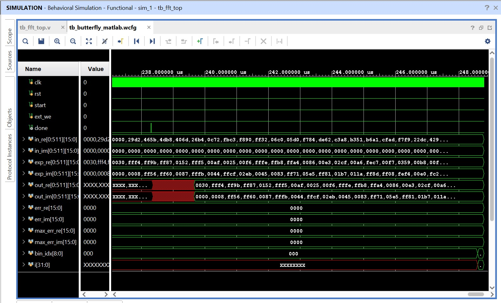

# ✅ Kavach 512-Point FFT Accelerator Core - Verification Environment

Welcome to the **verification branch** for the **Kavach 512-Point FFT Accelerator Core**. This repository represents the baseline, self-contained processing block developed as part of the **1TOPS initiative by the VLSI Society of India**.

This branch focuses on the standalone **512-Point Cooley-Tukey DIT pipelined mathematical engine** without the AHB wrapper, providing a clean testbench and MATLAB scripts to accurately verify the core's mathematical functionality.

## 📊 Verification Simulation

---

## ⏱️ The Silicon Timeline: From Power-On to First Execution

This timeline documents the cycle-accurate electrical data flows and state transitions of the accelerator core during operations:

### 1. The Clean Slate (Power-On Reset)
* **The Action:** The moment the device turns on, the SoC system controller asserts your `rst` (reset) pin high.
* **The Result:** Your Master FSM snaps into State 0 (Idle). All internal tracking loops (stages, butterfly counters) are wiped to zero. The `done` flag is pulled low. The chip is awake but waiting.

### 2. The Boot Sequence (Loading the Constants)
* **The Action:** The SoC’s main bootloader reads the pre-calculated complex sine/cosine numbers from the device's main flash storage.
* **The Data Flow:** The bootloader drives the pins for your newly added Twiddle RAM (Scratchpad B). Over the course of 256 clock cycles, it writes the trigonometry constants into memory.
* **The Result:** Your internal "reference manual" is fully populated. Scratchpad B is now locked.

### 3. The Audio Collection (Loading the Warehouse)
* **The Action:** The user speaks into the microphone. The SoC’s DMA (Direct Memory Access) controller takes over. It sets your `ext_we` (Write Enable) pin to HIGH.
* **The Data Flow:**
  * **Tick 1:** DMA sets `ext_addr` to `0` and pushes the first audio sample onto `ext_din`. Scratchpad A saves it.
  * **Tick 2:** DMA changes `ext_addr` to `1` and pushes the second sample onto `ext_din`. Scratchpad A saves it.
  * *(This repeats exactly 512 times as the audio frame fills up).*
* **Time Elapsed:** ~2.84 microseconds (512 clock cycles).

### 4. The Handover (Passing the Baton)
* **The Action:** The DMA has finished delivering the 512 audio samples. It drops `ext_we` to LOW.
* **The Data Flow:** On the very next clock cycle, the DMA pulses your `start` pin to HIGH for exactly one tick.
* **The Result:** Your Master FSM detects the start pulse. It immediately disconnects the RAM from the external pins. The workshop doors are now locked.

### 5. The First Butterfly (The Math Begins)
The FSM is now in total control. It initiates Stage 1 of the FFT, targeting the very first pair of audio samples.
* **Tick N (The 3-Way Read):**
  * The FSM points internal `addr_a` to slot `0` and `addr_b` to slot `1`.
  * It calculates the twiddle index and points to angle `0` in Scratchpad B.
  * **Data Flow:** Both audio samples and the exact trigonometry angle flow out of the memories and hit the input pins of the `butterfly_folded` module simultaneously.
* **Tick N+1 (Multiplication):** The Butterfly FSM wakes up. It fires its four 32-bit hardware multipliers to calculate $B \times W$ (Real and Imaginary components).
* **Tick N+2 (Truncation):** The 32-bit multiplied results are bit-shifted down to 16-bit Q15 format to prevent data bloat (division by $2^{15}$).
* **Tick N+3 (Addition/Subtraction):** The 17-bit sign-extended adders fire. They calculate $X = A + BW$ and $Y = A - BW$ simultaneously, safely avoiding any overflow clipping.
* **Tick N+4 (The Overwrite):**
  * The Butterfly finishes the math, bit-shifts back to 16 bits, and pulses its internal done flag.
  * **Data Flow:** The Master FSM sees the flag. Without moving its memory pointers, it pulses the internal write enables (`we_a` and `we_b`). The new frequencies $X$ and $Y$ instantly overwrite the original raw audio sitting in Scratchpad A at slots `0` and `1`.
* **Subsequent Butterflies:** The very first butterfly operation is now complete. The Master FSM immediately increments its counters to address `2` and `3`, and the assembly line fires up again. This will happen 2,303 more times until the `done` pin is finally raised for the outside world.

---

## 🛠️ Baseline Core Modules
1. **nm32_fft_top.v:** The primary FSM and Cooley-Tukey stage index controller.
2. **fft_data_ram.v (Scratchpad A):** The 2KB dual-port high-speed data memory block.
3. **twiddle_rom_512.v (Scratchpad B):** The reference look-up memory for trigonometry coefficients.
4. **butterfly_folded.v:** The 5-cycle pipelined mathematical butterfly execution unit.
5. **nm32_fft_ahb_wrapper.v:** The AHB protocol interface layer developed as part of the core accelerator.

---
*(Note: To view the full SoC system integration including the 16KB general Scratchpad SRAM and central AHB Decoder/Arbiter, please switch to the **`ahb-soc-complete`** branch.)*

---

# nm32_fft_top — Usage Notes

## Initialization (Before Every FFT Run)

**Twiddle RAM must be written before start.** The twiddle RAM is uninitialized on power-up — there are no default values. You must write all 256 entries via `tw_we / tw_ext_addr / tw_ext_din` before asserting `start`, or every butterfly will use garbage twiddle factors. Formula: `W[n] = floor(cos(2πn/512) * 32768)` for re, `floor(-sin(2πn/512) * 32768)` for im, packed as `{re[31:16], im[15:0]}`.

**Data RAM also starts uninitialized.** Write all 512 input samples via `ext_we / ext_addr / ext_din` before start. Any unwritten location will contain whatever the FPGA initialized to.

---

## Timing — Writing Inputs

**`ext_we` must be fully deasserted before `start`.** The FSM in state 0 mirrors `ext_we → ram_we_a` every posedge. If `ext_we` is still high when `start` is sampled, the FSM sees both simultaneously and ignores `start`. Allow at least 2–3 idle clock cycles after deasserting `ext_we` before asserting `start`.

**`start` must be a single-cycle pulse.** The FSM samples `start` in state 0 on posedge clk. Hold `start` high for exactly one clock cycle. If held longer, it may retrigger after the FSM returns to state 0 post-completion.

**Drive all inputs on negedge, sample outputs after posedge.** The RAM and FSM registers update on posedge. Drive `ext_we`, `ext_addr`, `ext_din` on negedge to ensure setup time is met at the next posedge.

---

## Timing — Reading Outputs

**There is a 2-cycle read latency through the port.** Reading back via `ext_addr / ext_dout` goes through two registered stages: `ext_addr → ram_addr_a` (one posedge in FSM state 0), then `ram_addr_a → dout_a` (one posedge in the RAM). You must wait 2 posedges after driving `ext_addr` before the data is valid on `ext_dout`.

**Wait for the FSM to return to state 0 before reading.** `done` pulses for exactly one cycle (state 6 → state 0). After you see `done`, wait at least 2 more posedges before starting readback — state 6 transitions to state 0 in one posedge, and `ram_we_a` from the last butterfly write needs one more cycle to clear.

**`done` is a one-cycle pulse — it will not wait for you.** Latch it on the posedge it appears. Do not rely on polling `done` after the fact. If your downstream logic misses it, you need to either latch it externally or use the AHB wrapper's `done_latched` register.

**For simulation readback, direct hierarchical access is more reliable.** Instead of fighting the 2-cycle port latency, read `dut.data_ram.ram[i]` directly after `done`. This is valid in simulation and avoids all timing ambiguity.

---

## FSM Behavior

**State machine has 8 states (0–7), state 6 fires `done`.** The computation path is: `0 → 1 → 2 → 3 → 4 → 5 → 7 → 1 → ...` repeating until all 512×9 butterflies are done, then `5 → 6 → 0`. State 7 is a one-cycle counter-stabilization state — this is why the FSM needs the extra idle cycle before using updated `j/k/s`.

**If the FSM hangs in state 4, the butterfly is stuck.** State 4 waits indefinitely for `bf_done`. There is no watchdog. If `butterfly_folded` never asserts `done` (e.g. due to a reset glitch or metastability on `start`), the entire FFT hangs. Consider adding an external timeout counter in your system.

**Reset is synchronous to posedge clk.** Both `nm32_fft_top` and `butterfly_folded` use `posedge rst`. Drive rst for at least 4 clock cycles to guarantee all pipeline stages clear. Do not assert `start` for at least 2 cycles after deasserting reset.

---

## Output Format

**Outputs are in the same order the emulation loop produces them.** The DIT FFT writes results back to the same RAM locations it reads from (in-place), so the output ordering matches the loop's natural traversal — not the standard textbook natural-frequency order. To interpret frequency bins correctly, apply a bit-reversal permutation to the output indices: natural frequency bin `k` is stored at RAM address `bitrev(k, 9)`.

**All outputs are scaled by 1/512.** Each of the 9 butterfly stages divides by 2 (`>>> 1`) to prevent overflow. The true DFT magnitude is therefore `output × 512`. Design your downstream processing accordingly — the dynamic range is reduced but overflow is impossible.

**Q15 arithmetic accumulates rounding error across stages.** Each butterfly truncates (floor) rather than rounds. Over 9 stages this can accumulate up to ±9 LSB of error in the worst case, though typical error on noise-floor bins is ±1–2 LSB. Tone bins with large magnitude are accurate; very small bins near the noise floor may have relatively large percentage error.

---

## AHB Wrapper Specifics (if using `nm32_fft_ahb_wrapper`)

**Start is triggered by writing bit 0 of address `BASE + 0x800`.** The wrapper generates the single-cycle `start` pulse when `is_ctrl_reg && s_wrap_take && wdata[0]`. A plain AHB write of `0x00000001` to the control register is the correct trigger.

**Done is latched in `done_latched` (bit 1 of `BASE + 0x800`).** Unlike the raw `done` signal which pulses for one cycle, `done_latched` stays high until the next `start`. Poll this register to know when results are ready.

**Data RAM reads through AHB require one wait state.** The wrapper inserts a `read_stall` cycle for RAM reads because the RAM is synchronous. The `ahb_slave_wait` module handles this transparently — expect 2-cycle read latency from the AHB perspective.

**`tw_we` / twiddle RAM ports are not exposed through the AHB wrapper.** The current wrapper only exposes the data RAM and control register. Twiddle RAM initialization must be done either at synthesis time (by modifying the RTL to use `$readmemh`) or by adding twiddle RAM write support to the AHB memory map.
